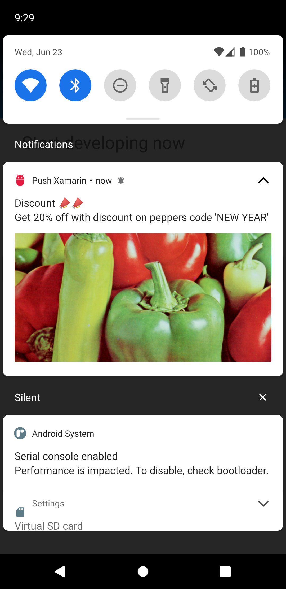

# Push Xamarin Notify
Firebase push notification with ImageUrl payload on Xamarin Android

# Setup
* Install following nuget package inside Xamarin Android Project
  * Xamarin.Firebase.Messaging
  * Xamarin.AndroidX.RecyclerView
  * Xamarin.Google.Dagger
* Get server key from firebase console and download goole-services.json file
* Place goole-services.json inside android project and set build action to GoogleServices.Json

# Learn More 
Link: https://docs.microsoft.com/en-us/xamarin/android/data-cloud/google-messaging/remote-notifications-with-fcm?tabs=windows

# Generate Notification icon 
Link: https://romannurik.github.io/AndroidAssetStudio/icons-notification.html#source.type=clipart&source.clipart=ac_unit&source.space.trim=1&source.space.pad=0&name=ic_stat_ac_unit

# Notification payload format

    public class NotificationPayload
    {
        [JsonProperty("to")]
        public string To { get; set; }

        [JsonProperty("data")]
        public Data Datas { get; set; }
    }
    public class Data
    {
        [JsonProperty("title")]
        public string Title { get; set; }

        [JsonProperty("body")]
        public string Body { get; set; }

        [JsonProperty("ImageUrl")]
        public string ImageUrl { get; set; }
    }
    
  You can import postman_collection.json to postman and push Firebase Notification. Make sure you replace header key with your server key.
  
  # Notification payload example
    {
      "to":"/topics/all",
      "data":
      {
          "title":"Discount 📣📣",
          "body":"Get 20% off with discount on peppers code 'NEW YEAR'",
          "ImageUrl":"https://homepages.cae.wisc.edu/~ece533/images/peppers.png"
      }
  
  Make sure you create your notification channel and suscribe to the topic that you are using in your payload 'to' parameter  
  Subscribe Notification ` FirebaseMessaging.Instance.SubscribeToTopic("all");`  
  For for details refer the repo code above.
  
 # Notification Preview
   
 
